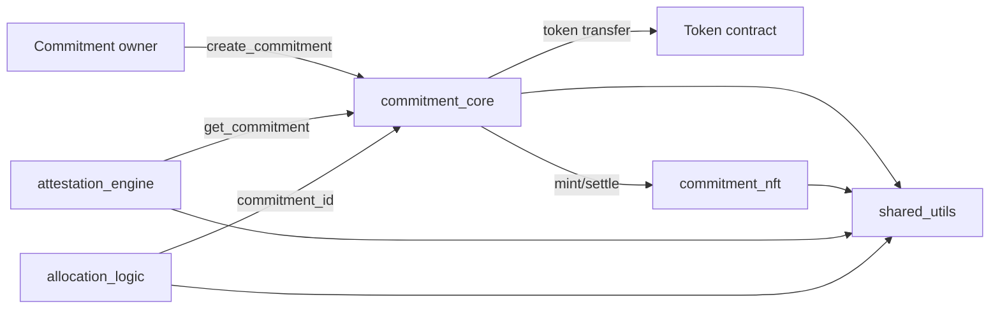

# Architecture

## Overview
CommitLabs contracts implement commitment lifecycle management, NFT representation, attestation tracking, and allocation strategies on Stellar Soroban. The workspace includes four contracts plus a shared utility library that standardizes validation, access control, arithmetic safety, and rate limiting.

## Components

| Component | Responsibility | Storage pattern |
| --- | --- | --- |
| commitment_core | Create commitments, transfer assets, mint NFTs, settle and early exit, track TVL | Instance storage for commitments, owner lists, admin, counters, and reentrancy guard |
| commitment_nft | Store NFT metadata, ownership, and active status | Persistent storage for NFTs/ownership, instance storage for admin and counters |
| attestation_engine | Record attestations, track health metrics, and analytics | Persistent storage for attestations and metrics, instance storage for admin and analytics |
| allocation_logic | Register pools, allocate and rebalance amounts | Persistent storage for pools/allocations, instance storage for admin and registry |
| shared_utils | Cross-cutting helpers (validation, access control, rate limiting, math) | Library only |

## Core flows

### Commitment lifecycle
1. `commitment_core::create_commitment` validates inputs, stores a commitment, transfers assets to the contract, and calls `commitment_nft::mint`.
2. `commitment_nft::mint` persists metadata and ownership data for the NFT.
3. `commitment_core::settle` and `commitment_core::early_exit` update commitment state, transfer assets, and call `commitment_nft::settle` for matured commitments.

### Attestations
1. `attestation_engine::attest` validates caller authorization and commitment existence.
2. It stores attestation data and updates health metrics for the commitment.
3. `attestation_engine::get_health_metrics` reads commitment data from `commitment_core` and combines it with attestations.

### Allocation
1. `allocation_logic::allocate` selects pools based on strategy and stores allocation records.
2. `allocation_logic::rebalance` recomputes allocations for an existing commitment id.
3. Allocation logic currently does not validate commitment ownership against `commitment_core` (see Known Limitations).

## Storage layout notes
- `commitment_core` stores commitments and owner lists in instance storage.
- `commitment_nft` stores token data and ownership in persistent storage.
- `attestation_engine` stores attestations and health metrics in persistent storage, with analytics counters in instance storage.
- `allocation_logic` stores pool registry in instance storage and pools/allocations in persistent storage.

## Architecture diagram

## Deployment topology
- Deployment order: commitment_nft -> commitment_core -> attestation_engine.
- allocation_logic is deployed independently.
- Contract IDs are stored in `deployments/*.json` and referenced by downstream systems.
